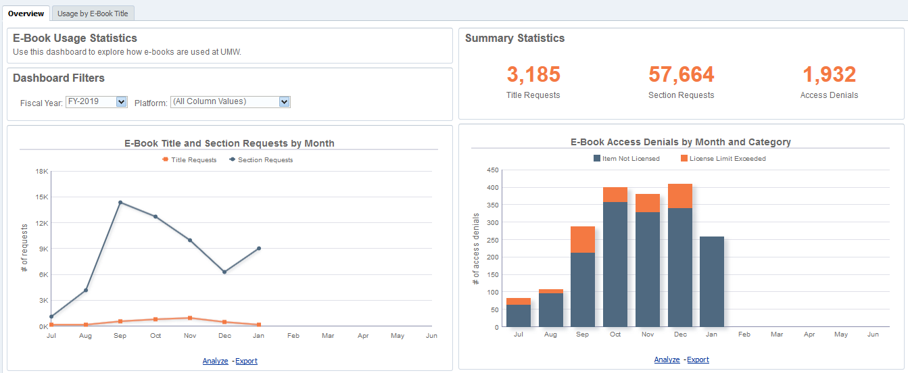

# Alma Analytics E-Book Usage Dashboard

Migrating to Ex Libris’ Alma provided the [University of Mary Washington (UMW) Libraries](https://libraries.umw.edu) an opportunity to begin systematically harvesting COUNTER-compliant usage statistics. Previously, UMW did not have an electronic resource management system (ERMS) and only pulled usage reports on an ad hoc basis. This made it difficult to know how e-books were being used, especially over time and across platforms. This project describes a dashboard that was created in Alma Analytics (OBIEE) to visualize e-book usage patterns from data imported into Alma manually and via SUSHI harvesting. It describes some of the customizations and provides sample SQL code. If you have questions or comments, contact Summer Durrant at <sdurrant@umw.edu>. 

## Dashboard Overview

The dashboard has three tabs. The Overview tab provides a quick snapshot of e-book usage and turnaways by platform and month. 
