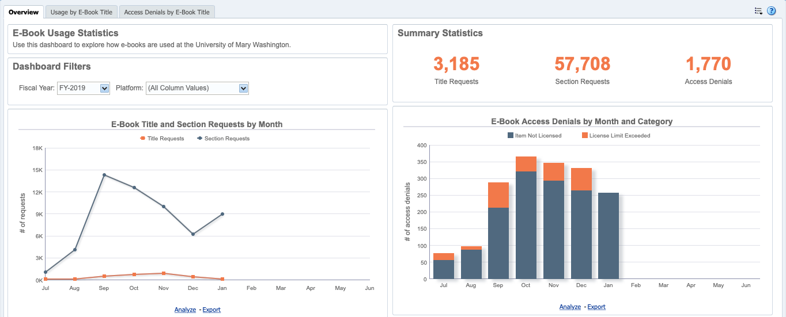

# Alma Analytics E-Book Usage Dashboard

Migrating to Ex Libris’ Alma provided the [University of Mary Washington (UMW) Libraries](https://libraries.umw.edu) an opportunity to begin systematically harvesting COUNTER usage statistics. Previously, UMW did not have an electronic resource management system (ERMS) and only pulled usage reports on an ad hoc basis. This made it difficult to know how e-books were being used, especially over time and across platforms. This project describes a dashboard that was created in Alma Analytics to visualize e-book usage patterns from data imported into Alma via manual upload and SUSHI harvesting. It describes some of the customizations that were made and provides sample SQL code that other institutions can adapt. If you have questions or comments, contact Summer Durrant at <sdurrant@umw.edu>. 

### Dashboard Customizations

The main customization that was made was modifying the appearance of platform names. Platform names come directly from COUNTER reports and are not always intuitive or user friendly. Tweaking their appearance makes the dashboard easier to read and understand. There are three broad categories for when platform names were changed.

The first is when a platform name was different than its common name. Gale uses GOLD for its databases and JSTOR uses its parent organization, Ithaka. Since dashboard users are not likely to know what GOLD or Ithaka mean, it makes more sense to use Gale and JSTOR. Similarly, some platform names have URLs or contain extraneous information. http://proquest.safaribooksonline.com was changed to Safari Books Online and “licensed content” was stripped from the end of ScienceDirect. 

Second, some vendors break down their platforms in ways that are not meaningful, at least not for the purposes of the dashboard. University Press Scholarship Online reports each university press as a separate platform (e.g., NYU Press, Stanford University Press, Yale University Press, etc.). This results in a cluttered appearance on the dashboard and does not give an accurate representation of how the platform is used as a whole. Aggregating these individual UPs into a single platform helps remedy these problems.

Third, some vendors have changed platforms over time. ProQuest initially hosted e-books on Ebrary but later migrated to ProQuest E-Book Central. While it may be interesting to examine changes in usage patterns after a migration, for the purposes of the dashboard, combining old and new platforms makes the most sense. 

It is important to emphasize that modifying the platform name for a dashboard **does not change the underlying raw data**. Instead, an SQL CASE statement is used to conditionally change the text display. One way to think about it is that we are creating temporary aliases for platform names to make them easier to understand. [An example of the SQL CASE statement](/sql) used to construct the platform variable is available.  

